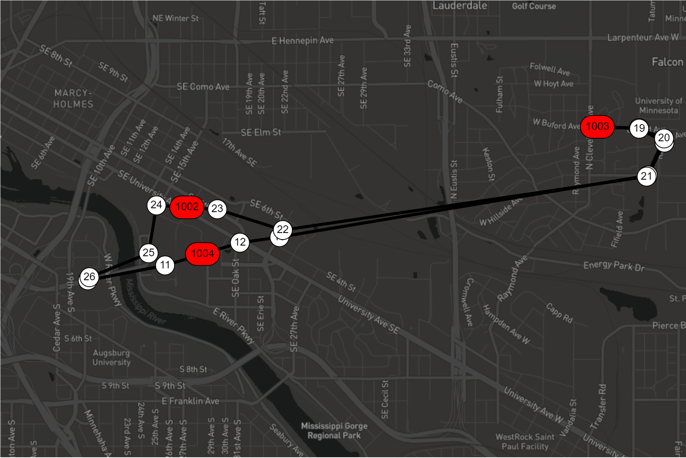

# ConfigSim and VisualizerSim: a Proof-of-Concept Transit System Vizualizer/Simulator

## Iteration 2 - VERSION 7, November 25 (various clarifications and reduction in scope)
### VERSION 6, November 20 (clarified that 'make all' in tests should BUILD test executable, not run all tests)
### VERSION 5, November 11 (updated bus position requirements in program functionality)
### VERSION 4, November 11 (clarified that following Lab 10 branching model is required)
### VERSION 3, November 11 (clarified necessity for project to build from _master_ branch and Google Style scope)
### VERSION 2, November 8 (clarified FileOutputSimulator make and execute commands)
### VERSION 1, November 7
- NOTE, THIS DOCUMENT IS SUBJECT TO CHANGE. CHECK IT EVERY DAY OR TWO

**Congratulations!**  Iteration 1 is in the rear-view mirror. Onward to Iteration 2!

As you've now seen in class, we're now moving on to incorporate some more practical elements that will aid our users in running simulations that can produce meaningful results. With the addition of the configuration manager, we can set up a variety of route and stop configurations that can be reused or slightly modified (or copied). And, with the visualizer, we can much more easily see the results of our labors. And, I suppose, the users get to see what's happening, too.

### Due Dates and Content

| Date</a> | Item | Description |
|:----:|:-----|:------------|
| WED, Nov 13, 11:55pm | [Domain Structs and File Output Simulator](#pre1) | submit via Github |
| WED, Nov 20, 11:55pm | [Configuration Builds from Makefile](#pre2) | Pass automated tests |
| WED, Nov 27, 11:55pm[1](#f1) | [Code Implementation and Testing](#final) | Automated tests and inspection |

#### Deliverables and Submission Process

Everything will be submitted via Github. We will pull your repository at the specified due dates and grade according to the contents at that time.

> Please verify that your submission compiles on a cselabs machine and it is complete. You will receive no grade or be heavily penalized if your code does not compile upon submission.

The schedule is very tight, and it is important that you keep up with the project. The project will continue to build throughout the semester, and if you get behind, it will be very difficult to catch up. For this reason, **late
assignments will not be accepted**, but you will receive partial credit for partial completion of the requirements.

You can convert this requirements document to pdf using this tool: http://www.markdowntopdf.com/

## Documentation and Code Implementation Requirements

### Overview

In this iteration, we need to add a few new elements to our design in order to allow for configuration and visualization of our simulations. Much of this has already been designed and implemented. The primary task will be to extend your domain elements to produce the data needed for visualization and merging the provided configuration and visualization code into your project code.

### Functional Requirements

> This is just functionality. Along the way, please document the code you write for this iteration using
Doxygen syntax and test for Google Style compliance using cpplint.

Below we specify the  three sets of  functionality you are to design and deliver for this iteration.

#### Preliminary 1: Domain Structures (Structs) and File Output Simulator

In order to better understand how the make process and Simulator code works, the first task asks students to make a new version of the TransitSim. The new version works almost identically to the original, but makes use of a file to capture the output, rather than using standard out (i.e., std::cout). Create this new driver and any other necessary code. Then, incorporate it into the makefile by adding a new set of targets so that a command can be issued to run the simulation and place all output into a file specified on the command line (e.g., 'make capture_transit_sim' followed by '../build/bin/capture_transit_sim run13.txt' or something similar).

Next, you need to extend your domain objects so that they can be used by the visualizer. The visualizer code is much like any other simulation. But, in order for it to work, the VisualizerSimulator (which will be provided to you) needs to be able to retrieve structs from the domain objects (for example busses, routes, and stops) that you've built. So, you will need to add an accessor that returns a C++ struct from your domain objects (specifically, Bus and Route) which meet the needs of the visualizer. Definition and examples of the structs that need to be generated and returned will be provided in lab on November 8.

#### Preliminary 2: Configuration Builds from Makefile

Incorporate the configuration manager, and its related Simulator and driver files, into the project. This includes modifying your makefile to incorporate these additions. You will need to determine how to provide the configuration filename (given on the command line or using a default if not specified) to the ConfigurationSimulator. This often seems simple, but can be difficult for many students. Makefile changes to include code that is not yours can be somewhat tricky.

#### Final Turn-in: Code Implementation and Testing

##### Code Implementation

At this point, both the configuration and visualizer simulations should be working. Running 'make' should build BOTH the ConfigSim and VisualizerSim executables (and both should be able to be built individually using other commands).

__Pushed to Iteration 3__
~~We also want to refactor one element of the project which could cause errors, especially now that we're pulling from user-defined configuration files. The current version of the probability list for stops includes the value for the final stop on a route. With nowhere to go, that probability needs to be 0. But, with configuration files, this can't be guaranteed without some changes to our code. Refactor the code so that there is no probability (even if provided by configuration) for the final stop in a route, and that the simulator does not use or try to access such a probability for the final stop in a route.~~

##### Testing

In this iteration, you should  test your system extensively. In addition to whatever unit or integration tests you think will be necessary to test your domain code (Bus, Stop, Route, and Passenger), we you will need to devise and implement code to run a few additional scenarios.

A scenario is a pre-determined set of events, either to exercise specific functionality or to ensure that things that should fail do indeed fail as expected (i.e. with proper error messaging and helpful instructions rather than system crash). To do this, create your own configuration files, your own Simulator subclass, and your own PassengerGenerator subclass. Implement your scenarios (at least three interesting scenarios) and see that they run. They must run from the command line (though you are also welcome to make them work with the visualizer if that helps you debug/test).

In iteration 1, you wrote a couple of very simple tests.  This wasn’t enough to seriously test the code but just enough to verify that you know how to write tests.  Now, it is time to do some more serious, organized testing. The specific testing requirements are:

Overall structure:
* Implement your tests using Google Test and by adding files to the tests directory, as we have been practicing so far.
* Running “make all” inside the tests directory should build all the tests.

Unit tests:
* Write a series of unit tests to thoroughly test your command line parsing.
* Test to make sure you catch errors in the command line so that you can respond by printing out a help message.
* At a minimum, you should write enough tests to cover:
	* Testing to make sure you detect an invalid command line for common errors or typos that users might make, such as forgetting to include file name or using the incorrect number of arguments.

__Pushed to Iteration 3__

~~Regression tests:~~

~~* For regression tests, the goal is to verify that features that worked once stay working, even as you continue to add to the code.~~
~~* For our simulations, that probably means some relatively simple and structured scenario that can be reused and in which we know the exact output.~~
~~* To use this testing strategy with Google Test, you should add a PROJ/resources directory to your repo where you can store your config file and anything else that might be helpful when trying to ensure that changes didn't break anything that was already working.~~

## Assessment

Your software **must compile on a cselabs machine or it will not be graded, and you will receive a zero for your submission**. Your software **must compile on the _master_ branch or it will not be graded, and you will receive a zero for your submission**. We will not grade your project unless it compiles. As long as you provide a version that compiles, we will evaluate those aspects that are partially functional for partial credit. In other words, <u>comment code out if it breaks compilation</u>.

Your software will be assessed through automatic testing and by the TAs. If possible, we'll provide as much automated feedback as we can prior to the deadline. At the deadline, all submissions will be downloaded and the automated testing will no longer be available. Through both automated testing and the TAs, the process for testing will be to `make clean` then `make`. We **highly encourage** you to create a new folder on a **cselabs machine**, clone your repo on a **cselabs machine** in that folder, then run  `make clean` and `make` in your newly cloned repo, followed by a run of your tests to confirm all is working well before submitting your tests and code.

You can use this high-level grading rubric to better understand how we will grade the project and as a checklist to make sure you have completed everything.

50% - Program Design (Typically graded by hand by inspecting the code)
* Code follows the well-designed solution discussed and diagrammed in class.  
	* We will discuss pros and cons of various approaches to refactoring in class, and, together, we’ll come to an "instructor approved" solution.  Your solution should follow the class-decided solution rather than coming up with your own approach.
* Code follows good design and style practices as discussed in class.
	* Class interfaces follow McConnell’s guidelines of implementing just a single abstract data type within each class and using consistent levels of abstraction.
	* Class and important variable names are informative.
	* Comments are included to describe the intent of each public member function in every class __you wrote__.
	* Additional comments are included in areas where the intent of the code is not obvious from reading the code itself and where future programmers would encounter a special case or unusual aspect of the code that they would find surprising.
	* The tests show evidence of thinking about aspects of the design that are "worth testing" (e.g., boundary conditions, areas of change).

50% - Program Functionality and Robustness (Typically graded by running the code, either using scripts or interactively)
* Both program versions (configuration and visualization) build without error by running "make" in the root directory of the project, and the two programs run on the CSE Lab machines.
* The code links with the visualizer code to produce working visualizations of a running simluation.
* A Bus's position does not matter EXCEPT when a bus is at a stop. If a bus is dropping off/picking up, its position must show it is at the stop.
* The configuration functionality is functional, allowing the use of a variety of configuration files.
* Both unit tests and regression tests are implemented.
* Tests cover valid/invalid command line options.
* Tests cover different numbers of options specified on the command line.
* Tests cover all domain objects (Bus, Route, Stop, Passenger) including their interactions with other objects.
* The project follows Google Style as demonstrated by passing the cpplint.py checks. ~~ALL code in within project/src will be processed.~~ All code you developed will be processed, including the primary domain classes and files related to the ConfigurationSimulator you've written.
* The project follows the branching model recommended in Lab 10, including use of branches and issues

##Important notes to remember

>Your software is a reflection of your understanding of the requirements as specified in this document. If you do not understand any portion of the requirements or you think that the requirements are underspecified, it is your responsibility to get clarification from the instructor or a TA. Please read this document carefully and review it prior to turning in your iteration for assessment.

>The ONLY supported environment is the CSELabs environment. This is where we will run your code for assessment, and where you should absolutely ensure that your project will compile and run. It is recommended to log onto a CSELabs machine, do a **clean** pull of your repo (i.e., pull into a brand new directory), and then build and test your project.

<b id="f1">1</b>: This is the day before Thanksgiving. We *STRONGLY RECOMMENDED* you finish before this  day. Chances of obtaining help later into the day and evening will almost certainly be slim to non-existent. In addition, any technical snafus on this day will not result in an extension (as was the case in Iteration 1). GET DONE BY MONDAY NOVEMBER 25th! [Back to Content↩](#a1)
